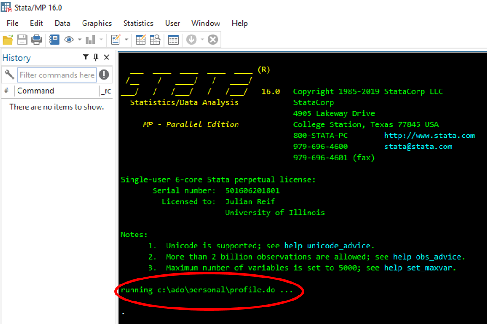

---
layout: default
title: Stata Coding Guide
description: Julian Reif, University of Illinois
---

This guide describes how to put together a "push-button" publication-quality analysis in Stata. Following this guide will help:
1. Minimize coding errors during analysis
1. Automate the creation of tables and figures
1. Provide seamless integration with supporting *R* analyses
1. Produce a replication folder suitable for publication

As part of this guide, I created a comprehensive template that includes an example paper along with an accompanying replication package, available [here](https://github.com/reifjulian/my-project). Try it out and see how easy (or not!) it is for you to reproduce my example analysis. If you encounter problems let me know.


The rest of this guide explains the logic behind the organization of this template and provides instructions for how to set up a robust environment for your Stata projects.

<!-- Table of contents
1. toc1
{:toc}
-->


# Setting up your environment
-----------

I work on several projects at the same time, access them from multiple computers (laptop, home, work, etc.), and share them with multiple coauthors. Using multiple environments makes it hard to define the pathname (location) of a folder. A project's location may be **/Users/jreif/MyProject** on one computer and **/Users/coauthor/MyProject** on another computer. You could manually change this pathname every time a different person or different computer runs the code, but this solution is cumbersome for large projects with thousands or millions of lines of code. A better solution is to define a variable that points to the project folder.

Below I describe how I set up my working environment to address this challenge. Note that users are NOT required to set up an environment like I do in order to run my published code. But, setting up your environment like I do will make it easier to develop your analysis in environments with multiple computers and coauthors.

## Dropbox

I use Dropbox to sync my projects across environments. Dropbox has several appealing features. It creates backups of my projects across multiple computers and the Dropbox server, and in my experience has fewer bugs than alternatives such as Box. Dropbox makes it easy to share files with coauthors. All files stored in Dropbox have the same relative paths, which is helpful when writing scripts (more on this below).

## Stata profile

Stata automatically runs the script **profile.do** upon launch (if found).



**profile.do** must be stored in one of the paths searched by Stata. Type `adopath` at the Stata prompt to view a list of the eligible paths for your particular computer. On my mac, I store this file in **/Users/jreif/Documents/Stata/ado/personal/profile.do**. On my PC, I store it in **C:/ado/personal/profile.do**.

Here are the contents of the Stata profile stored on my PC:
```stata
* Settings specific to local environment
global DROPBOX "C:/Users/jreif/Dropbox"
global RSCRIPT_PATH "C:/Program Files/R/R-3.6.2/bin/x64/Rscript.exe"

* Run file containing settings common to all environments
run "$DROPBOX/stata_profile.do"
```

This file contains settings specific to my PC, namely the location of my Dropbox folder and my *R* executable (useful if you use [rscript](https://github.com/reifjulian/rscript)). The Stata profile stored on my mac is identical except that it defines different locations for DROPBOX and RSCRIPT_PATH. I could also define the locations of all my projects in **profiledo**. But instead, I store those definitions on Dropbox at **$DROPBOX/stata_profile.do**, along with any other settings that are common across my computers, in a script called **stata_profile.do** and then call that script from **profile.do**.

Here are the contents of an example **stata_profile.do** stored on Dropbox:
```stata
set varabbrev off
global MyProject "$DROPBOX/research/my-project/MyProject"
```

The first line, `set varabbrev off`, is a command I want executed every time I open Stata on all my computers, for reasons [I explain below](#good_coding_practice). The second line defines the location of [MyProject](https://github.com/reifjulian/my-project/tree/master/MyProject), which I stored on Dropbox. In practice my Stata profile defines a large number of globals, one for every project I am working on. Whenever I start a new project, I define a new global for it and add it to **$DROPBOX/stata_profile.do**. Because all my computers are synced to Dropbox, I only have to do this once.

## *R* profile

I write most of my code in Stata, including C++ plugins such as [strgroup](https://github.com/reifjulian/strgroup). On occasion, I will use an *R* function that is not available in Stata, such as [XGBoost](https://xgboost.readthedocs.io/en/latest/). In these cases I find it convenient to setup an *R* environment that is consistent with my Stata environment.

Similar to Stata, *R* automatically runs **.Rprofile** upon launch (if found). (More background available [here](https://csgillespie.github.io/efficientR/3-3-r-startup.html#r-startup) if you're interested.) This file is typically stored in your home directory, whose location you can find by typing `normalizePath(path.expand("~"),winslash="/")` at the *R* prompt.

Here are the contents of my *R* profile, stored in **C:/Users/jreif/Documents/.Rprofile**:
```R
# Settings specific to local environment
Sys.setenv(DROPBOX = "C:/Users/jreif/Dropbox")

# Run file containing settings common to all environments
source(file.path(Sys.getenv("DROPBOX"), "R_profile.R"))
```

As with my Stata profile, my *R* profile in turn runs a second script located at the top level of my Dropbox directory. This file, **R_profile.R**, stores *R* settings common across all my computers, such as the paths for all my projects. Here is an example that defines the location for one project, `MyProject`:

```R
Sys.setenv(MyProject = file.path(Sys.getenv("DROPBOX"), "research/my-project/MyProject"))
```

# Organizing the project
-----------

## Folder structure

A project can include lots of materials: the analysis, the manuscript, related literature, grant proposals, etc. Your analysis, which includes both code and data, should be kept in a distinct location. Keeping the analysis separate will make it easier to create a standalone replication package when the project is complete.

A typical analysis starts with raw data (e.g., a dataset downloaded from the web). Scripts process these data and run the analysis. Scripts and data should be stored in separate folders. The core structure for the project's analysis looks like this:

```text
.
└── analysis/
    └── data/
        └── raw/
    └── scripts/
        ├── 0_run_all.do
        └── 1_...
```

The master script, **0_run_all.do**, executes the entire analysis. Running this script creates all necessary additional folders, intermediate files, and results:

```text
.
└── analysis/
    └── data/
        ├── proc/
        └── raw/
    └── results/
        ├── figures/
        └── tables/
    └── scripts/
        ├── 0_run_all.do
        └── 1_...
```

At any time, you can delete all these extra folders, keeping only **data/raw/** and **scripts/**, and then rerun your analysis from scratch. When the project is complete, a copy of **analysis/** serves as a standalone replication package.

The analysis folder contains three subfolders. **scripts/** includes all scripts and libraries (add-on packages) required to run the analysis. **data/** includes raw and processed data. **data/raw/** is read-only. Scripts write files only to **data/proc/** or **results/**.

**results/** contains all final output, including tables and figures. These can be linked to a LaTeX document on Overleaf or stored in an adjacent folder. For example, [MyProject](https://github.com/reifjulian/my-project/tree/master/MyProject) has the following folder structure:

```text
.
└── analysis/
    └── data/
        ├── proc/
        └── raw/
    └── results/
        ├── figures/
        └── tables/
    └── scripts/
        ├── 0_run_all.do
        └── 1_...
└── paper/
    ├── manuscript.tex
    ├── figures/
    └── tables/
```

When you are ready to update your manuscript, copy **analysis/results/figures/** and **analysis/results/tables/** to **paper/**, which contains manuscript files. Additional documents such as literature references can be stored in **paper/** or in a separate, standalone folder at the top the project directory.

## Programs

Programs (aka functions, subroutines) are pieces of code that are called repeatedly by your scripts. These might be do-files, ado-files, or scripts written in another programming language such as *R*. An introduction to ado-files is available [here](https://blog.stata.com/2015/11/10/programming-an-estimation-command-in-stata-a-first-ado-command). Because programs are not called directly by the master script, **0_run_all.do**, I store them in the subdirectory **scripts/programs/**. This reduces clutter in large projects with many scripts.

## Libraries

My code frequently employs user-written Stata commands, such as [regsave](https://github.com/reifjulian/regsave) or [reghdfe](http://scorreia.com/software/reghdfe/install.html). To ensure replication, it is **very important** to include copies of these programs with your code:
1. Unless a user has a local copy of the program, she won't be able to run your code if you don't supply this program.
1. These commands are updated over time and newer versions may not work with older code implementations.

Many people do not appreciate how code updates can inhibit replication. Here is an example. You perform a Stata analysis using a new, user-written estimation command called, say, `regols`. You publish your paper, along with your replication code, but do not include the code for `regols`. Ten years later a researcher tries to replicate your analysis. The code breaks because she has not installed `regols`. She opens Stata and type `ssc install regols`, which installs the newest version of that command. But, in the intervening ten years the author of `regols` fixed a bug in how the standard errors are calculated. When the researcher runs your code with her updated version of `regols` she finds your estimates are no longer statistically significant. Is this because you included the wrong dataset with your replication, because there is mistake in the analysis code, or because you failed to correctly copy/paste your output into your publication? The researcher does not know. She cannot replicate your published results and must now decide what to do.

Stata takes version control [seriously](https://www.stata.com/features/integrated-version-control/). At a minimum, you should always include a `version` statement in the final version of your published code. Writing `version 15` instructs all future versions of Stata to run your code the same way Stata 15 did. (Your [master script](https://github.com/reifjulian/my-project/blob/master/MyProject/analysis/scripts/0_run_all.do) is a good place for the version statement.) Unfortunately, many user-written packages (including my own) are not carefully version controlled.  To address this, I include a script called [_install_stata_packages.do](https://github.com/reifjulian/my-project/blob/master/MyProject/analysis/scripts/_install_stata_packages.do) in all my working projects. This script installs a copy of any user-written packages I need for the project into a subdirectory of the project folder: **analysis/scripts/libraries/stata**. Rerunning this script will install updated versions of these add-on's (if desired). I delete this script when my project is ready to be published, which effectively locks down the code for these user-written packages and thus ensures I can exactly replicate my Stata analysis forever. In addition, including these user-written packages allows my project to be replicated on a non-networked computer that does not have access to the internet.

I am unaware of a version control statement for *R*. As a second-best solution, my replication packages include an *R* program, [_confirm_version.R](https://github.com/reifjulian/my-project/blob/master/MyProject/analysis/scripts/programs/_confirm_version.R), which checks whether the user: (1) is running a sufficiently recent version of *R*; and (2) has installed necessary add-on programs such as [tidyverse](https://tidyverse.tidyverse.org/). As with Stata, it is possible to install these add-on packages into your project subdirectory. In practice, doing this in *R* creates headaches. Add-on packages such as tidyverse are very large (hundreds of megabytes) and--if you want to ensure cross-platform replicability--need to be installed separately for Mac, Unix, and Windows. Doing this for my (very simple) example project would increase that project's file size by nearly a gigabyte! I therefore again settled for a second-best solution and instead require the user to install these packages themselves. I provide those installation instructions in the project's README and in [_confirm_version.R](https://github.com/reifjulian/my-project/blob/master/MyProject/analysis/scripts/programs/_confirm_version.R) to make this as simple as possible.

If you don't mind using up lots of disk space and want to ensure reproducibility, I recommend installing your *R* packages in the project subdirectory just like I did with Stata. See [_install_R_packages.R](https://github.com/reifjulian/my-project/blob/master/MyProject/analysis/scripts/programs/_install_R_packages.R) for an example. Following this example will result in a folder structure that looks like this:

```text
.
└── analysis/
    └── data/
    	└── raw/
    └── scripts/
        ├── functions/
        └── libraries/
    	    ├── R/
    	    └── stata/
```
Other alternatives--used frequently by serious users of *R*--include [packrat](https://rstudio.github.io/packrat/) and [renv](https://rstudio.github.io/renv/articles/renv.html).

### Stata plugins (advanced)

Most Stata add-on's are written in Stata or Mata, which are cross-platform, i.e., they can be run on any computer that has a copy of Stata. A small number of Stata add-ons are written in C/C++ and must be compiled to a plugin (DLL) that is specific to your computer's architecture (Mac vs PC, 32 vs 64 bit, etc.). If you write C/C++ code for Stata, I encourage you to compile it for multiple platforms and include all platform-specific plugins as part of your replication package. See [gtools](https://github.com/mcaceresb/stata-gtools) and [strgroup](https://github.com/reifjulian/strgroup) for examples of how to write a program that autodetects which plugin to call based on your computer's architecture.

# Publishing your code
-----------

You've done an analysis, written up your results, and had a paper accepted. It's now time to publish your code store it on a public website or secure repository such as the [ICPSR data enclave](https://www.icpsr.umich.edu/icpsrweb/content/ICPSR/access/restricted/enclave.html)! If you've followed the steps above, publishing is easy. Follow these steps before publishing your code to ensure replication.

1. Make a copy of the **analysis/** folder.
1. Add a [README file](https://github.com/reifjulian/my-project/blob/master/MyProject/analysis/README.pdf) to the copy of the **analysis/** folder. The README should include the following information:
    i. Title and authors of the paper
    i. Required software, including version numbers
    i. **Clear** instructions for how to run the analysis. If the analysis cannot be run--because the data are proprietary, for example--this should be noted.
    i. Description of where the output is stored

1. Remove **_install_stata_packages.do** from the **scripts/** folder.

1. (Optional) Disable all locally installed Stata programs not located in your Stata folder. (This will ensure that your analysis is actually using programs installed in your project subdirectory, rather than somewhere else on your machine.) On Windows, this can usually be done by renaming **c:/ado** to **c:/_ado**. You can test whether you succeeded as follows. Suppose you have a copy of `regsave` somewhere on your machine and also in your local project directory. Open up a new instance of Stata and type `which regsave`. Stata should report "command regsave not found". If not, Stata will tell you where the command is located, and you can then rename that folder by adding an underscore.

1. Delete the **data/proc/** and **results/** folders.

1. Run **0_run_all.do**, which should rerun the entire analysis and regenerate all tables and figures.

1. Copy **results/figures/** and **results/tables/** to the **paper/** folder.

1. Recompile the paper and double-check the numbers.

1. Rename the copy of your **analysis/** folder to something more descriptive, and zip it.

Checking numbers can be difficult and tedious. Include lots of asserts in your code when writing up your results to reduce errors. (See an example of how to use `assert` commands [here](https://github.com/reifjulian/my-project/blob/master/MyProject/analysis/scripts/4_make_tables_figures.do).

# Stata coding tips
-----------

Use forward slashes for pathnames (**$DROPBOX/project** not **$DROPBOX\project**). Backslashes are an escape character in Stata and can cause issues depending on what operating system you are running. Using forward slashes ensures cross-platform compatibility.

Never use hard-coded paths like **C:/Users/jreif/Dropbox/MyProject**. All pathnames should reference a global variable defined either in your Stata profile or in your master script, **0_run_all.do**. I should be able to run your entire analysis from my personal computer without having to edit any of your scripts. (With the exception of maybe having to define a global variable.)

Include `set varabbrev off` in your Stata profile.  Most professional Stata programmers I know do this in order to avoid unexpected behaviors such as [this](https://www.ifs.org.uk/docs/stata_gotchasJan2014.pdf).

When working with very large datasets, install and use Mauricio Caceres' [gtools](https://github.com/mcaceresb/stata-gtools).

Sometimes an analysis will produce different results each time you run it. Here are two common reasons why this happens:
1. One of your commands requires random numbers and you forgot to use `set seed #`
1. You have a nonunique sort. Add `isid` checks to your code prior to sorting to ensure uniqueness. (Another option is to add the `unique` option to your sorts.) Nonunique sorts can be hard to spot:

```stata
* The random variable r here is not unique, because Stata's default type (float) does not have enough precision when N=100,000.
* isid will therefore generate an error (unless you have changed Stata's default type to double)
clear
set seed 100
set obs 100000
gen r = uniform()
isid r

* Cast r as a double to avoid this problem
clear
set seed 100
set obs 100000
gen double r = uniform()
isid r
```


# Other helpful links
-----------

[AEA Data Editor's guide](https://github.com/AEADataEditor/aea-de-guidance)

[Dan Sullivan's best practices for coding](http://www.danielmsullivan.com/pages/tutorial_workflow_3bestpractice.html)

[Gentzkow and Shapiro coding guide](https://web.stanford.edu/~gentzkow/research/CodeAndData.pdf)

[Grant McDermott's data science lectures](https://github.com/uo-ec607/lectures)

[Roger Koenker's guide on reproducibility](http://www.econ.uiuc.edu/~roger/research/repro)


# Acknowledgments
-----------

The coding practices outlined in this guide have been developed and improved over many years. I would especially like to thank my frequent collaborators Tatyana Deryugina and David Molitor for providing many helpful suggestions that have improved my project organization over the years. I also thank Grant McDermott for helpful conversations regarding version control and reproducibility in *R*.
